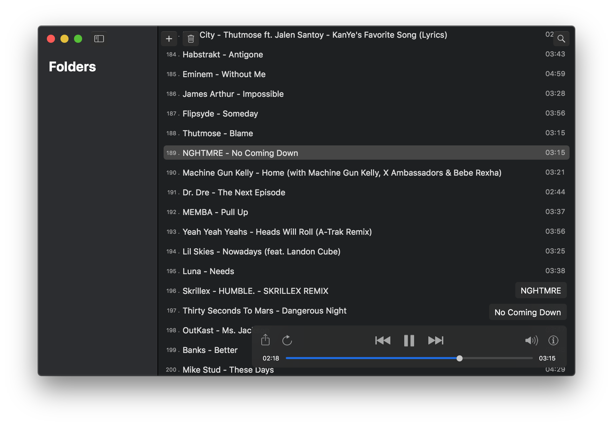
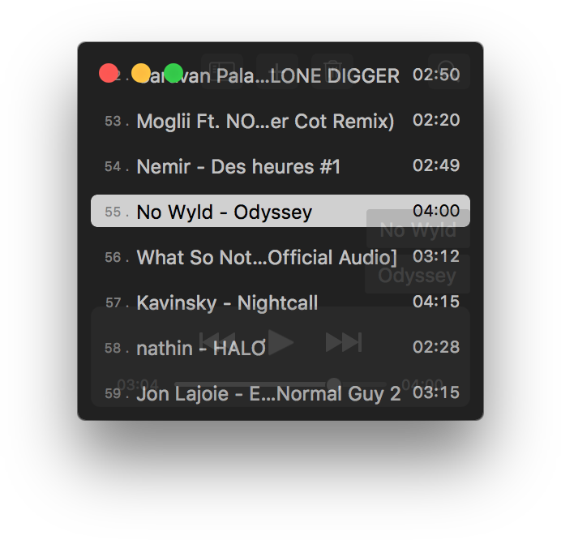
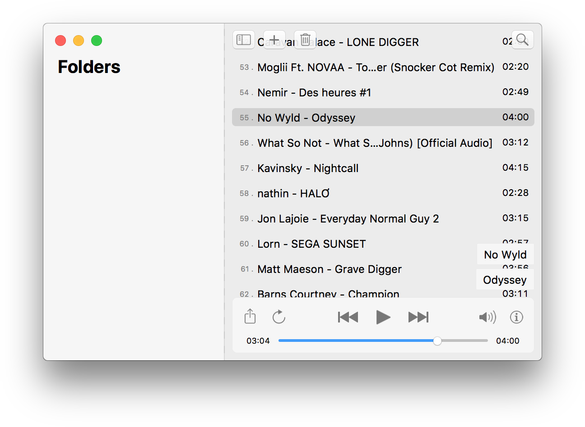

# SwiftAudioPlayer

Purely written in code with the latest Swift version.

This is my "Work in progress" audio player for macOS, written entirely in Swift.
It's just a little project of mine to learn more about swift and macOS app development, since I'm quite new to programming.

Any help and/or contribution for further development is greatly appreciated.
Let's make this a great and easy to use open source music player for macOS.

## ToDo-List:
- [x] make it possible to import audio files and display them in a list
- [x] add ability to play imported files
- [x] light and dark theme
- [ ] additional playlist management (reordering, saving and loading playlists)
- [ ] implement currently missing features (search, shuffle, details, etc.)
- [ ] adding music folders and playlists to the sidebar
- [ ] add basic settings page
- [ ] remember current playlist and added folders
- [ ] additional features

